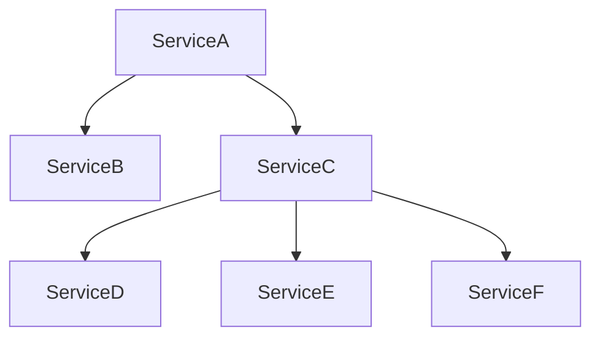

<p align="center" width="100%">
  
</p>

**Important note: This is still in the making but as this was requested, I'm open-sourcing the first version**.

# A practical introduction to the whys of Effect

This introduction comes from Effect workshops I gave in which the main objective was to explain in few hours the whys of Effect coming from raw JavaScript/TypeScript.

This introduction **is not about how to write Effect code** but rather focuses on why Effect might be an interesting pick for writing softwares using TypeScript as of today taking into account all the common problems we face as developers. As a rule of thumb, each developer should be aware of the problems a tool is solving before even trying to take a look at the implementation details. Hopefully with that short introduction you will **first become aware of the existing problems** and then **understand how elegantly and efficiently Effect solves them**.

## **Effect is a well-rounded tool solving a lot of well-known software engineering problems. Let's first talk about problems before solutions.**

**Inspiration**

This is highly inspired by both excellent talks from [Michael Arnaldi (@mikearnaldi) at the WorkerConf](https://www.youtube.com/watch?v=zrNr3JVUc8I) and [Mattia Manzati at React Alicante](https://www.youtube.com/watch?v=uwALExyq4NY).

N.B: If you're already comfortable with the problems Effect tries to solve and wish to jump straight into the **hows of Effect**, I suggest you to take a look at the official [Effect documentation](https://effect.website/) (still in the works) and the [excellent crashcourse from Stefano Pigozzi (@pigoz)](https://github.com/pigoz/effect-crashcourse).

## Samples and source code

In the `src/` folder you will be able to find some samples used alongside the introduction. There is also a TypeScript version if you prefer to both read the content and have the ready-to-be-run and type-checking samples.

Note: TypeScript files are still in the making so they might be incomplete/outdated as of now.  

## Outcomes you can expect from the introduction

- **Understanding most commons problems we're facing as developers**
- **Understanding limits we're facing as JavaScript/TypeScript developers**
- **Basic understanding of Effect**
- **Basic understanding of an "Effect System"**
 
Before diving into Effect, let's take a step back talking about what problems we commonly face as developers.
Effect is a tool in the same way as TypeScript is a tool. Our responsibility is to first understand the problems as it would help us finding the good solutions. 

What are the most common challenges we are facing when developing softwares?

- ### [**Explicitness**](#1-explicitness)
- ### [**Testing**](#2-testing)
- ### [**Resilience**](#3-resilience)
- ### [**Composability**](#4-composability)
- ### [**Concurrency**](#5-concurrency)
- ### [**Efficiency & Performance**](#6-efficiency--performance)
- ### [**Tracing & Logging**](#7-tracing--logging)
 

We'll show examples using TypeScript, but this is not only related to JavaScript/TypeScript concern. It **concerns every ecosystem, language**, for instance Effect was initially heavily inspired by [ZIO](https://zio.dev/), its Scala counterpart, because most of the problems also apply to Scala.

Hopefully, you'll realise that Effect is just a **tool that addresses hard problems** that we will always face, regardless the underlying ecosystem/language.

Before diving into these problems and the solutions Effect brings, let me just do a pretty
quick prelude that will help you understand right away the approach.

## 0. Prelude

Let's talk a little bit about the Effect datatype in itself with a bit of background history.

`Effect` is the core datatype of the ecosystem, but what if I tell you that it
could have been called `Program` instead? The reason for that is that Effect
tries to model exactly what a program is, that is something that requires
an environment to run, that can fail with an error or succeed with a value.

> You can see the original conversation started by @mikearnaldi [just there in Effect's Discord](https://discord.com/channels/795981131316985866/795983589644304396/948653981863923813)
 
Consequently, Effect is a datatype with 3 generic type parameters:
`R`: represents the **environment** required to run the program
`E`: represents the **error** that can be produced by the program
`A`: represents the **value** that can be produced by the program

Resulting in: `Effect<R, E, A>`.

```ts
import type { Effect } from "@effect/io/Effect";

type Program<Environment, Error, Success> = Effect<
  Environment,
  Error,
  Success
>;
```

Let's just model a simple command-line interface program (with a very high
level of abstraction). We can say that our command line program requires
a process to run, that will be granted by the OS. It's represented by the first
generic type parameter `R`. Then, our program can fail with an error of type
`E` (Standard Error) or succeed with a value of type `A` (Standard Output).

```ts
type Process = any;
type Stdout = any;
type Stderr = any;

type CommandLineProgram = Program<Process, Stderr, Stdout>;
```

Having these 3 generic parameters explicitly defined in the type signature
of our program allows us to have a very precise understanding of what our
program is doing and what it can produce as a result. In addition to explicitness,
Effect provides us a very strong type safety guarantee that the constraints of the
generic type parameters will be respected by the implementation of the program.

## 1. Explicitness 

<p align="left">
    <a href="https://github.com/antoine-coulon/effect-introduction/blob/main/src/01-explicitness.ts" target="_blank">
      
      Go to source file (01-explicitness.ts)
     </a>
</p>

The ability of making a program self-describing, allowing to have a clear vision and understanding what outcomes the program can produce without having to run it.

Ideally, what we want is:

- explicit errors
- explicit dependencies
- explicit outcomes

Let's see few examples using TypeScript first, then with Effect


## Synchronous computations

```ts
function multiplyNumber() {
  const generatedNumber = NumberGeneratorLibrary.generateRandomNumber();
  //    ^ number
  return number * 2;
}
```

Unfortunately when running the code our program crashes: `Error at <anonymous>`
Without taking a look at the implementation of the `generateRandomNumber()`, we don't even know that this thing might throw an error. The consequence of that is having runtime defect makes the process just die. Think of that in a wider scope of a program, where this can be very hard to properly handle. 

```ts
export function generateRandomNumber(): number {
    const randomNumber = Math.random();

    if (randomNumber > 0.9) {
      // RIP
      throw new Error();
    }

    return randomNumber;
}
```

This behavior can be the root cause of many problems including defensive coding, for instance:

```ts
function defensiveMultiplyNumber() {
  try {
    const number = NumberGeneratorLibrary.generateRandomNumber();
    return number * 2;
  } catch {
    // Just in case
  }
}
```

Or we need to deal with runtime errors the hard way:

```ts
function blindlyCatch() {
  try {
    const random = Math.random();

    if (random > 0.9) {
      throw new SomeError();
    }

    if (random > 0.8) {
      throw new SomeOtherError();
    }

    return random;
  } catch (exception: unknown) {
    if (isSomeErrorException(exception)) {
      // do something
    } else if (isSomeOtherErrorException(exception)) {
      // do something else
    }
  }
}
```

The solution that we just found is not ideal and even if there is only thirty lines of code, compromises must already be done because we simply lack of explicitness.


## Asynchronous operations

One way to model an async computation with JavaScript is using a Promise whose results is always delivered asynchronously.

```ts
function doSomething(): Promise<number> {
  return new Promise((resolve) => {
    setTimeout(() => {
      resolve(3)
    });
  });
}

doSomething().then(
  // Callback will be executed at some point in time (generally as soon as possible)
  () => {

  }
);
```

However, Promises are both conceptually limited and lacking a lot of important features to deal with common problems that we face.

## Drawbacks of a Promise 😥

- **Eagerly executed, hence is impure, referentially-opaque and is running computation (already a value). Consequently, can't be used around for writing functional programs.**

You might already know this eager nature of a Promise, but you might not know that it prevents many interesting rules to be applied. 

Purity and referential transparency are important concepts in Functional Programming because they allow you to make assumptions about the behavior of your program levaraging mathematical laws (compositions and substitutions of expressions, etc). Moreover, it helps reasoning about the behavior of your program by just looking at the types, which is what we also target with explicitness. By leveraging compilers, in our case TypeScript, we will be constrained to a set of well-behaved types and principles, allowing us to eliminate whole classes  of bugs and unexpected behaviors.

A more detailed version of the explanation is available in the **[01-explicitness.ts](https://github.com/antoine-coulon/effect-introduction/blob/main/src/01-explicitness.ts) source file**

- **Implicit memoization of the result (either success or failure).**

 As we already said, a Promise is eagerly executed. It means that as soon as you create a Promise, the computation is already running and might have already completed with a value. That value produced by the Promise is implicitly memoized meaning that when the Promise is settled, the internal state of the Promise is frozen and can't be changed anymore, whether the Promise is fulfilled or rejected. Consequently if you want to run the same computation again, you'll need to recreate the Promise from scratch. Altough this is convenient because it allows subscribers to receive the value even when registering for it after the Promise produced its value, this makes the behavior of a Promise non-reusable and does not favor retries and compositions.
  
- **Has only one generic parameter: `Promise<A>`. The error is non-generic/non-polymorphic.**

Promise has only one generic parameter, which is the type of the value produced. This is not really convenient because it means that the error is not reflected by default in the type of the Promise. This highly restricts the type-level expressiveness and forces us to deal with untyped and unknown failures. We could say that only generic parameter can be used to represent the error using Either/Result representations, but this model has its own limitations when it comes to combining many operations together and when trying to inferthe type of the errors of the whole chain. 

- **Can't depend on any contextual information.**

A Promise can't explicitely encode the fact of depending on some contextual information. It means that if you want to run a Promise that depends on some input context, dependencies can not be explicitely modeled hence it is impossible to statically constrain the Promise to only be run in a valid context i.e. with all the requirements satisfied.

This is a problem because this means that Promises can implicitely rely on hidden dependencies and does not offer any flexibility when it comes to composition and dependency injection. By nesting Promises, that implicit layer of dependencies will grow and it will be harder to reason about the behavior and the requirements of the program.  

A more detailed version of the explanation is available in the **[01-explicitness.ts](https://github.com/antoine-coulon/effect-introduction/blob/main/src/01-explicitness.ts) source file**

- **No control over concurrency.**

Natively, a Promise does not offer any control execution over concurrency 
so when composing many Promises together, you can't control how many Promises
can be spawned and run in parallel (unbounded concurrency). 
This is a problem because in most cases you will end up either spawning too many 
Promises and overloading the system or constrain Promises to run sequentially 
and not taking advantage of the asynchronous nature of the platform.

This is talked in more details in the  [**Concurrency**](#5-concurrency) section of the introduction.

- **Not much built-in combinators (then, catch, finally) and static methods (all, allSettled, race, any, resolve, reject).**

By default, Promises don't have much combinators to work with nor Promise constructors and are lacking some important features, for instance `all` and `allSettled` are _unbounded_ concurrency-wise, `race` and `any` are working as expected but are unsafe because "race losers" are not cleanly interrupted hence underlying resources can not be released (it's also the case for `Promise.all`).
  
- **No builtin interruption model.**

Following what was said just before, Promises unfortunately don't have a built-in interruption model. There was one attempt to [introduce cancellation to Promises that was withdrawn](https://github.com/tc39/proposal-cancelable-promises) for some [unclear reasons](https://github.com/tc39/proposal-cancelable-promises/issues/70). My 2 cents is that it was because adding cancellation into Promises would have introduced too many changes, and the initial design constrained the evolution of the builtin features around Promises.

In any case as of now, we are not able to cancel a Promise using the standard API.

- **No builtin retry logic.**

Another feature which won't never see the light of day is the built-in retry policies. Given that a Promise already represents a running computation in itself, it can not be easily retried without being constructed again. We can work around these limitations by introducing lazy promises which are nothing but Promises wrapped in functions over which we have the control, but this approach reduce flexibility, composability and introduce quickly some avoidable complexity.

A more detailed version of the explanation is available in the **[03-resilience.ts](https://github.com/antoine-coulon/effect-introduction/blob/main/src/03-resilience.ts) source file**


---

Promises are everywhere and are part of most codebases when dealing with asynchronous programming, so you might wonder what could be a solid alternative to that. Let's jump right into it.

## Alternatives 1/2

## fp-ts


[fp-ts](https://github.com/gcanti/fp-ts) created by [Giulio Canti (@gcanti)](https://github.com/gcanti) is the most popular functional programming library in the TypeScript ecosystem and provides developers with popular patterns and reliable abstractions from typed functional languages.

fp-ts introduced primitives that allow to model such things:

**Synchronous**

- `IO<A>`: Represents a lazy and synchronous computation that are not expected to fail, meaning that executing the thunk produces a value `A`. 
  
```ts
type IO<A> = () => A  
```

Because errors can't explicitely be represented using `IO<A>`, it means that conventionally the side effect must not throw any unexpected errors.

- `IOEither<E, A>`: When it comes to explicitely representing a typed error that can be produced by the execution of a synchronous computation, **fp-ts** provides us `IOEither<E, A>`. It represents a synchronous computation that can fail with an error `E`.

**Asynchronous**

- `Task<A>`: It is essentially the same as `IO<A>` except that it describes an asynchronous computation that is not expected to fail.
- `TaskEither<E, A>`: It is essentially the same as `IOEither<E, A>` except that it describes an asynchronous computation that is expected to fail with an error `E`.

Cool, we already found a solution to favor explicitness and model both the success or failure an operation can produce. It's a great step towards a stronger primitives, but still requires us to make a difference between asynchronous or synchronous computations. Why should we care about whether it's async or sync? We don't care! Ideally, we would like to be able to represent a computation that can both fail with an error `E` or succeed with a value `A` for all types of computations and always describe it the same way. There are already many difference between how to deal with asynchronous and synchronous error propagation, and there are even many ways to deal with asynchronous error handling (callbacks vs promises), we want to simplify that both at the type-level and at runtime.

Moreover, there is still:
- no builtin control over concurrency 
- no builtin interruption
- no builtin retry
- composing/combining multiple Tasks gets quickly hard to read
- semantic differences between synchronous and asynchronous operations
 
## Alternatives 2/2

**Effect**

The new kid in town


```ts
/**
 * An Effect is modeled with the datatype Effect<R, E, A>
 * (R) represents requirements a computation needs in order to be run
 * (E) represents the failure a computation can produce
 * (A) represents the successful outcome a computation can produce
 */ 
interface Effect<R, E, A> {}
```

In the context of explicit outcomes, `Effect` is a data type that can be used to model everything at the same time:
- no distinction between synchronous/asynchronous computations, everything is just a computation
- can be used to model computations that are expected to fail or not fail, the `Either` datatype is embedded in the Effect data type

But also Effect is:

- lazy by nature
- highly composable
- highly type-safe
- explicit errors and dependencies management (dependencies and `R` and discussed right after)
- builtin concurrency control
- builtin interruption 
- builtin retry
- builtin resource management (acquire/release)

The primary goal of an Effect is to act as a representation of a computation or more generally a program whose outcome (error or success) and dependencies are explicitely modeled.

## How we can improve that way of handling errors?

Now that everyone is up-to-date with challenges we are facing dealing with synchronous and asynchronous (promise-based) computations, it's time to go back on our dear _explicitness_ and see how Effect solves that.

To improve the way of handling errors, we can improve the way they are described, and finally make them part of the type signature as well as the value. One universal solution that you might already now is `Either` (Result-like) implemented natively in Rust, Kotlin, Haskell... Can be implemented in TypeScript as well.

```ts
interface Either<A, B> {
  readonly left: A;
  readonly right: B;
}
```

An `Either<A, B>` at its root has nothing to do with errors, it's simply a datatype that aims to represent a values with two possibilities, either "A" (left) or "B" (right). The Either type is sometimes used to represent a value which is either correct or an error; by convention, the Left constructor is used to hold an error value and the Right constructor is used to hold a correct value. This Either specialization is what most people now know as a `Result<E, A>`.

```ts
interface Result<Error, Success> extends Either<Error, Success> {}
```

Effect integrates an `Either<E, A>` under the hood of each computation, making it both easy and explicit to deal with.


```ts
type _ = Effect<R, E, A>
//                 ^__^ -> Either-like
```

Do you remember our first raw TypeScript samples? Let's rewrite it with Effect. Let's consider some code:

```ts

import { pipe } from "@effect/data/Function";
import * as Effect from "@effect/io/Effect";

namespace EffectNumberGeneratorLibrary {
  export function generateRandomNumber(): Effect.Effect<never, Error, number> {
    return pipe(
      Effect.sync(() => Math.random()),
      Effect.flatMap((randomNumber) => {
        if (randomNumber > 0.9) {
          return Effect.fail(new Error());
        }

        return Effect.succeed(randomNumber);
      })
    );
  }
}

```

If you take a close look at the above `generateRandomNumber()` signature, you can see that we have the error typed as `Error`. Consequently if you describe an Effect that should not produce any known failure that is having the error channel typed as `never` (`Effect<never, never, number>`) and try to directly consume an effect that has a typed failure (in that case typed `Error`), it won't compile. It's great, because we are forced by the compiler to be rigorous and to deal with the error.

Let's see that in action, with `multiplyNumberWithoutDealingWithError` that is not supposed to produce failures.

```ts
function multiplyNumberWithoutDealingWithError(): Effect.Effect<
  never,
  never, // E is typed as 'never', meaning that this Effect is not expected to produce failures (in the same way as IO<A> or Task<A>). 
  number
> {
  return EffectNumberGeneratorLibrary.generateRandomNumber();
  // ^ Type 'Effect<never, Error, number>' is not assignable to type 'Effect<never, never, number>'
}
```

So now that we are aware of the constraint, how do we come from a description of a computation that will eventually produce a failure to a computation that does not produce failures? Dealing with errors in a recoverable fashion is pretty straightforward.

```ts
function multiplyNumberWhenDealingWithError(): Effect.Effect<
  never,
  never,
  number
> {
  return pipe(
    EffectNumberGeneratorLibrary.generateRandomNumber(),
    Effect.flatMap((number) => Effect.succeed(number * 2)),
    // Recovering from the error and producing a successful result value instead
    Effect.catchAll(() => Effect.succeed(0))
  );
}
```

After having described our recovery logic, the error channel is immediately being changed from `Error` to `never` meaning that `multiplyNumberWhenDealingWithError` computation can benefit from the description of a computation that won't produce expected failures. Consequently we can just deal nicely with that outcome by relying on the typings and be confident about the outcome of the computation.

In that case it's still a very simple example, but keep in mind that Effect leverages pretty well inference in a way that it can keep track and compose the error channel of dozens of chains of effects.

Another benefit of having a dedicated error channel is that we can also model multiple failures using tagged unions.
In the following example, by just using TypeScript tagged classes, we are able to make Effect infer a union of typed errors.

```ts

export class NumberIsTooBigError {
  readonly _tag = "NumberIsTooBigError";
}

export class NumberIsTooSmallError {
  readonly _tag = "NumberIsTooSmallError";
}

namespace EffectNumberGeneratorLibrary {
  export function generateRandomNumber(): Effect<
    never,
    NumberIsTooBigError | NumberIsTooSmallError,
    number
  > {
    return pipe(
      Effect.sync(() => Math.random()),
      Effect.filterOrFail(
        (randomNumber) => randomNumber > 0.9,
        () => new NumberIsTooBigError()
      ),
      Effect.filterOrFail(
        (randomNumber) => randomNumber < 0.2,
        () => new NumberIsTooSmallError()
      )
    );
  }
}
```

Note: there might be some cases where TypeScript isn't able to unify union types properly, but thankfully using Effect combinators (here: `filterOrFail`) we are able to bypass these limitations.

I'm not going to dive into this subject there, but you can read more either in the [01-explicitness.ts](https://github.com/antoine-coulon/effect-introduction/blob/main/src/01-explicitness.ts) section or in the [following Discord thread](https://discord.com/channels/795981131316985866/1115294739382669312).


Now that we have failures represented as a union, it allows us to pattern match and recover from either specific failures or all failures. Depending on that choice, pattern matched failures will be erased from the error channel and other ones will just remain until some recovery logic is defined at some point. 

```ts

function multiplyNumberWithExhaustivePatternMatching(): Effect<never, never, number> {
  // Note how the error channel becomes "never" now that we exhaustive pattern match                                           
  return pipe(
    EffectNumberGeneratorLibrary.generateRandomNumber(),
    // If there is no failure
    Effect.flatMap((number) => Effect.succeed(number * 2)),
    // If there are failures, pattern match.
    Effect.catchTags({
      NumberIsTooBigError: () => Effect.succeed(0),
      NumberIsTooSmallError: () => Effect.succeed(1),
    })
  );
}

```

In the above case the pattern matching is exhaustive, but if it's not the case, the members of the union not being covered by the matching will be still reflected in the error channel.

```ts

function multiplyNumberWithPartialPatternMatching(): Effect.Effect<
  never,
  NumberIsTooBigError,
  // ^ partial pattern matching does not erase all errors
  number
> {
  return pipe(
    Effect2NumberGeneratorLibrary.generateRandomNumber(),
    Effect.flatMap((number) => Effect.succeed(number * 2)),
    Effect.catchTags({
      NumberIsTooSmallError: () => Effect.succeed(1),
    })
  );
}

```
 
**Explicit dependencies**

<p align="left">
    <a href="https://github.com/antoine-coulon/effect-introduction/blob/main/src/01-explicitness.ts" target="_blank">
      
      Go to source file, section "Explicit dependencies" (01-explicitness.ts)
     </a>
</p>

Effect can embed contextual information in the same way as the `Reader` data type from `fp-ts` was describing it.

It makes the dependencies required for the computation to be run also explicit. Let's say we have a very simple use case whose purpose is to register a new user on a given platform. 
The use case is meant to be agnostic of implementation details, that means that it ignores how the user registration is indeed persisted, whether it is in a database or some other storage service. 
The only thing the use case is responsible for is to orchestrate correctly all the business requirements. 
In our very simple example below, it's only registering the user to a given storage (in a real world application it could be dispatching a domain event, and putting both the user registration and the even dispatch in the same transaction, a la [Transactional Outbox](https://microservices.io/patterns/data/transactional-outbox.html) for instance).

```ts

import * as Effect from "@effect/io/Effect";
import * as Context from "@effect/data/Context";

interface UserRepository {
  createUser: () => Effect.Effect<never, UserAlreadyExistsError, CreatedUser>;
}

const UserRepository = Context.Tag<UserRepository>();

// Use case depending on an abstract User Repository
function registerUser(): Effect.Effect<UserRepository, UserAlreadyExistsError, CreatedUser> {
                                    // ^ explicit dependency
  return pipe(
    UserRepository,
    Effect.flatMap((userRepository) => userRepository.createUser()),
    // ... do something more as part of the use case, sending domain events, etc.
  );
}

```

What it means is that `registerUser` needs an instance of some service that implements the interface `UserRepository`. Until the requirements are satisfied, the program won't compile:

```ts
const mainProgram = Effect.runPromise(registerUser());
      // ^ Type 'UserRepository' is not assignable to type 'never': ts(2345)
```

We **can't compile the program because we didn't satisfy the dependencies**. 

How does it work? Theorically speaking, it's simple. The runtime interpreter checks that the Effect we're trying to run has all the dependencies satisfied. Statically at the type-level, we're able to determine that by checking
the `R` type parameter of the Effect. If the `R` type parameter is `never`, it means that all dependencies of the Effect are satisfied. Otherwise, it means that some dependencies are missing (the ones still visible in the `R` type).

```ts
const _program = useCases.registerUser();
//    ^ The type here is Effect<UserRepository, UserAlreadyExistsError, CreatedUser>
```

Because the `R` still has `UserRepository`, it means that the dependency needs to be provided in order for the effect to be run.

One benefit of having explicit dependencies is that conceptually the requirements are very clear and dependencies are not hidden/implicit. 
Dependencies appearing in the `R` generic type parameter is only refering to interfaces not any real implementations, this has for consequence to let room for the **Dependency Inversion Principle to easily spread everywhere in a effortless way**.

This example shows the use of one dependency, but it's important to note that Effect is able to **deeply infer the dependencies required as a TypeScript Union type**, wherever the dependencies come from in the Effect tree:

```ts
const computation1: Effect<DependencyA, never, number> = {};

const computation2: Effect<DependencyB, never, number> = {};

const program: Effect<DependencyA | DependencyB, never, number> = Effect.gen(function* ($) {
                      // ^ See how both respective dependencies from "computation1" and "computation2"
                      // now were propagated in the dependencies of our main program, represented as a typed union.
  const result1 = yield* $(effect1);
  const result2 = yield* $(effect2);

  return result1 + result2;
});
```

In that case, there is no deep Effect nesting but the principle remains the same.

If you're interested in the story behind the representation of the dependencies as a Union Type, [here is the section explaining that in the official Effect documentation](https://effect.website/docs/faq/coming-from-zio).

### Type-safe dependency injection

Just before, we mentioned the fact that until a required dependency is satisfied, the program won't compile. Effect provides us a type-safe dependency injection mechanism helping us satisfy the dependency graph.

```ts

pipe(
  registerUser(),
  // Dependency injection
  Effect.provideService(UserRepository, {
    createUser: () =>
      // We don't care about the implementation, it could be anything, as soon
      // as it implements the interface contract.
      // Here we just satisfy the interface by producing the expected failure
      Effect.fail(new UserAlreadyExistsError("User already exists")),
  }),
  Effect.runPromise
);
```

Until we provide the service implementation, the program won't compile because all the computation requirements are not satisfied.

```ts
Effect.runPromise(something as Effect<SomethingService, never, void>)
// ^ This won't compile, a computation for which all the requirements are not satisfied (SomethingService) can't be executed.

Effect.runPromise(
  pipe(
    something, // now becomes Effect<never, never, void>, because an implementation matching the interface was injected.
    Effect.provideService(SomethingService, {})
  )
);
```

**Service composition**

In real-world application scenarios, services would also depend on a set of other services quickly creating a complex dependency graph to satisfy. 



Thankfully to manage dependency injection at scale, Effect embeds `Layers` which are **recipes for creating services in a composable, effectul, resourceful and asynchronous way**. 
Their goal is to overcome standard constructor limitations and offer more powerful and safe service construction primitives.

Layers describe a set of required dependencies (In) and produces a set of composed dependencies (Out). During Layer construction, errors can occur, hence the Layer signature:

```ts
export interface Layer<RIn, E, ROut> {}
```

In the same spirit as for Effects, using Layers for which dependencies are not satisfied will result in compilation errors. 

As part of the introduction, this `Layer` section ends up there. If you want to know more about Layers, here is a list of advanced resources:
- [Effect API reference](https://effect-ts.github.io/io/modules/Layer.ts.html)
- [Layer chapter from pigoz's crashcourse](https://stackblitz.com/github/pigoz/effect-crashcourse?file=006-layer.ts)
- [ZIO ZLayer documentation](https://zio.dev/reference/di/zlayer-constructor-as-a-value)

## 2. Testing

<p align="left">
    <a href="https://github.com/antoine-coulon/effect-introduction/blob/main/src/02-testing.ts" target="_blank">
      
      Go to source file (02-testing.ts)
     </a>
</p>

Testing is the ability of asserting that a system behaves as expected. As obvious as it may seem, testing can be very tricky if the program is coupled to implementation details and has implicit (hidden dependencies) that we can't control.

Thankfully, Effect is explicit towards dependencies and favors the use of the Dependency Inversion Principle (DIP) by forcing each computation to depend on an abstraction (interface) rather than on an implementation. 

Let's come back to our previous section example:

```ts
interface UserRepository {
  createUser: () => Effect.Effect<never, UserAlreadyExistsError, CreatedUser>;
}

const UserRepository = Context.Tag<UserRepository>();

function someUseCase(): Effect.Effect<UserService, UserAlreadyExistsError, CreatedUser> {
  return pipe(
    UserRepository,
    // ^ Just a Tag linked to an interface, there is no implementation yet.
    // The use case completely ignores the implementation of the repository,
    // it just relies on its interface.
    Effect.flatMap((userRepository) => userRepository.createUser()),
  );
}
```

Having that Dependency Inversion Principle applied together with the builtin dependency injection mechanism, we can easily test programs:

```ts

class InMemoryUserRepository implements UserRepository {
  createUser() {
    // 
  }
}

it("Should do something", async () => {
  const user = await Effect.runPromise(
    pipe(
      createUser(), 
      Effect.provideService(UserRepository, InMemoryUserRepository)
    )
  );
  expect(user).toEqual("something");
});

```

As we can see, testing is very easy with Effect and it was thought from the ground up to allow an effect description to be decoupled from its implementation details.

Note that this is also beneficial for many other use cases other than testing, for instance changing very easily implementations of a service without breaking code depending on the contract.

## 3. Resilience

<p align="left">
    <a href="https://github.com/antoine-coulon/effect-introduction/blob/main/src/03-resilience.ts" target="_blank">
      
      Go to source file (03-resilience.ts)
     </a>
</p>

Resilience is the art of designing and implementing software systems that can gracefully and efficiently recover from most types of failures.

We saw that explicitness and type-safety offered by Effect allow us to erase a whole set of bugs and cleanly deal with errors. 

`If it compiles, it works` - slogan in the making. I can confirm that from my Effect experience since one year and a half.

Consequently, Effect is a very powerful datatype, with a deep inference mechanism making Effect programs highly type-safe. It brings the type-safety to a whole new level by using TypeScript in a excellent way.

As we saw from the [**Explicitness**](#1-explicitness) part, Effect forces us to deal with errors case and forces us to describe computations that are both mathematically correct and make sense from a computer science perspective.

But most of the time, we don't only want to catch error, we also want to retry with some custom policy, that mostly depend on the system we are targeting and its own constraints.

Using vanilla TypeScript, we know and saw before how to deal with an error happening, but how can we simply write a retry mechanism for a given computation?

Let's start by writing a dummy use case which is unluckily always failing. Then, we can start writing a little `retry` function that is able to retry the computation X times, nothing fancy there.

```ts
async function businessUseCase() {
  throw new Error();
}

async function retry(fn: () => Promise<void>, times = 1): Promise<void> {
  try {
    await fn();
  } catch {
    if (times === 0) {
      return;
    }
    return retry(fn, times - 1);
  }
}

retry(businessUseCase, 5);
```


Great, we are able to retry the computation as many times as we want! But what if we want to retry both X times but also on a specific condition?


```ts
async function businessUseCase() {
  const random = Math.random();
  if (random > 0.9) {
    throw new Error("error_1");
  }
  throw new Error("error_2");
}

async function retry(
  computation: () => Promise<void>,
  times = 1,
  shouldRetry: (e: unknown) => boolean
): Promise<void> {
  try {
    await computation();
  } catch (error) {
    if (times === 0 || !shouldRetry(error)) {
      return;
    }
    return retry(computation, times - 1, shouldRetry);
  }
}

retry(
  businessUseCase,
  5,
  (error) => error instanceof Error && error.message === "error_2"
)
```

As we can see, the complexity grows very quickly for simple cases. In most real-world scenarios, we would want to add time delays between retries, bound the retrying with a maximum duration, etc. Writing it all in that fashion would be very tedious and error-prone.

If we want to combine multiple rules, that is adding a specific debounce of exponential backoff, this would become nearly unmaintainable. 

Consequently as the `retry` function gets more specific, we:
- lose flexibility
- lose composability 
- lose the ability of having an error specialization
- increase the complexity
  
Thankfully, Effect also comes in with a rich set of builtin ways to deal with retry policies, allowing us to combine a lot of different and human readable strategies.

Let's rewrite the code examples with Effect.

```ts
import * as Effect from "@effect/io/Effect";
import { pipe } from "@effect/data/Function";
import * as Duration from "@effect/data/Duration";
import * as Schedule from "@effect/io/Schedule";

const computationWithFiveRetries = pipe(
  Effect.fail(new Error("Some error")),
  // Number of retries
  Effect.retryN(5)
);

const computationWithRetryUntil = pipe(
  Effect.sync(() => Math.random()),
  Effect.flatMap((random) =>
    Effect.fail(
      random > 0.5 ? new Error("Forbidden") : new Error("Unauthorized")
    )
  ),
  // Retry until the condition is met
  Effect.retryUntil((error) => error.message !== "Forbidden")
);
```
 
And even more complex ones, combining multiple policies to create one composed policy that:
- Always recurs, but will wait a certain amount between repetitions using exponential backoff, up until the point where repetitions are bounded to 1 second 
- Recurs while the time elapsed during the whole policy is less than or equal to 30 seconds

```ts
import { pipe } from "@effect/data/Function";
import * as Duration from "@effect/data/Duration";
import * as Schedule from "@effect/io/Schedule";

export const retrySchedule = pipe(
  Schedule.exponential(Duration.millis(10), 2.0),
  Schedule.either(Schedule.spaced(Duration.seconds(1))),
  Schedule.compose(Schedule.elapsed()),
  Schedule.whileOutput(Duration.lessThanOrEqualTo(Duration.seconds(30)))
);
```

We are able to describe a complex retry policy in few lines of code, in a very explicit, elegant and composable way.

Note: one more example is available in the associated TypeScript file (`src/03-resilience.ts`).

**Interruption**

Still in the context of **Resilience**, Effect also allows to deal with interruptions thanks to its concurrency model based on **Fibers**. 

I'm not going to expand on what Fibers are in this section because it will be done in the [**Concurrency**](#5-concurrency) section, but very briefly a Fiber is a lightweight concurrency primitive able to run computations in a type-safe, composable and resource-safe way. Fibers are said resource-safe, meaning that they allow us to model **safe resource acquisition and release** in case of interruptions, avoiding memory leaks and letting room for many graceful shutdown/clean up mechanisms.

Being able to interrupt computations is a very common pattern, let's take for instance `Promise.race`:

```ts
import { setTimeout } from "node:timers/promises";

Promise.race([
  setTimeout(1000),
  setTimeout(10000),
]);
```

You might use `Promise.race` as a convenient way to schedule two asynchronous tasks with the objective of cancelling the loser after the winner settled. Conceptually, racing is a great way of achieving that, the problem being that both computations will be settled letting you think that we are fully done with the tasks, but the truth is that the loser will indeed keep running in the background, without being properly released. 

One better way of doing that would be to use the `AbortController` Web API:

```ts
import { setTimeout } from "node:timers/promises";

function makeRace() {
  const abortController1 = new AbortController();
  const abortController2 = new AbortController();

  async function cancellableTimeout1() {
    await setTimeout(1000, undefined, { signal: abortController1.signal });
    console.log("Aborting timeout 2");
    abortController2.abort();
  }

  async function cancellableTimeout2() {
    await setTimeout(10000, undefined, { signal: abortController2.signal });
    console.log("Aborting timeout 1");
    abortController1.abort();
  }

  return Promise.race([cancellableTimeout1(), cancellableTimeout2()]);
}
```

In that case, the Abort Controller API provide us a way to ask some asynchronous computation to abort its current execution. One drawback of this approach is that it can be very tedious to implement correctly and the control flow becomes very quickly error-prone. Implementing support for the API can even become leaky itself, we'll see that just after our new example.

Let's take a new example of a simple job running in the background, using a `setInterval` processing literally nothing. 

For that we are going to use API that everyone is most likely used to (`setInterval`), that acquires a resource (a timer) and needs to release it at some point (`clearInterval`) when we finished processing the job after 10 seconds.

```ts
import { setTimeout } from "node:timers/promises";

async function backgroundJob() {
  const processTime = 10_000;
  const interval = setInterval(() => {
    console.log("process something...");
  }, 500);

  try { 
    await setTimeout(processTime);
  } finally {
    clearInterval(interval);
  }
}
```

Internally, we are able to use the classic `try/finally` control flow allowing to model the `use` and `release` actions. Let's see how we are able to cancel the job in itself from the outside world, that is being able to cancel at any point in time the `setInterval`.

It becomes a bit more tricky when trying to implement support for the Abort Controller API as we must involve it everywhere in the control flow, it can become tedious and error-prone.

```ts
import { setTimeout } from "node:timers/promises";

async function backgroundJobWithCancellation(signal: AbortSignal) {
  const processTime = 10_000;

  if (signal.aborted) {
    return;
  }

  let interval: NodeJS.Timer;

  signal.addEventListener("abort", () => {
    console.log("aborting job, releasing timer resource...");
    clearInterval(interval);
  }, {
    once: true
  });

  interval = setInterval(() => {
    // process something...
  }, 1000);

  try {
    // inherits from the same signal to cancel this timer as well
    await setTimeout(processTime, undefined, { signal });
  } finally {
    clearInterval(interval);
  }
}
```

You might have noticed it, but if we stop there, we're still leaking memory. In most scenarios, either when receiving a cancellation request through the signal or when the `processTime` requests the end of task, the `setInterval` timer is correctly released. However in the later case, the task just ends without using the provided signal, meaning that the listener callback (on "abort" event) will never be called. In that specific case, we are wastefully keeping in memory that listener. Thankfully, `addEventListener` also natively supports the Abort Controller API. 

```ts
import { setTimeout } from "node:timers/promises";

async function backgroundJobWithCancellation(signal: AbortSignal) {
  const processTime = 10_000;

  if (signal.aborted) {
    return;
  }

  let interval: NodeJS.Timer;
  const abortController = new AbortController();

  signal.addEventListener("abort", () => {
    clearInterval(interval);
  }, {
    once: true,
    // added that
    signal: abortController.signal,
  });

  interval = setInterval(() => {
    // process something...
  }, 1000);

  try {
    await setTimeout(processTime, undefined, { signal });
  } finally {
    // abort to release the listener
    abortController.abort();
    clearInterval(interval);
  }
}
```

Also, note that in the case were we receive an "abort" signal, we clear the interval two times, ideally we would want avoid releasing something already released as it might produce failures, but in that case clearing a timeout that was already destroyed [does literally nothing](https://github.com/nodejs/node/blob/a40a6c890afe0d1d0ca78db015146178c25af079/lib/timers.js#L184).

From the external world if we want to interrupt the computation, we also have to manipulate our own instance of the Abort Controller we then provide in the `backgroundJobWithCancellation` function arguments:

```ts
async function main() {
  const controller = new AbortController();

  // later in time
  setTimeoutCb(() => {
    controller.abort();
  }, 1000);

  await backgroundJobWithCancellation(controller.signal);
}
```

As we can see with that example, it's very easy to miss some important details in the control flow as adding listeners to manage cancellation is also adding a resource that can originate memory leaks. When nesting and having child computations, you must ensure to **propagate the parent signal in all the computation tree, making it tedious and very hard to maintain properly**.

Let's see now the difference using Effect and how it deals with interruptions. Effect embeds its own way of scheduling timers, the prefered way to do that would be to use `Effect.repeat` (an example is available in the [03-resilience.ts](https://github.com/antoine-coulon/effect-introduction/blob/main/src/03-resilience.ts) source file). 

Just so that the example remains simple with the same timer API, let's keep using `setInterval`.

```ts
const backgroundJob = pipe(
  Effect.asyncInterrupt(() => {
    const timer = setInterval(() => {
      console.log("processing job...");
    }, 500);

    return Effect.sync(() => {
      console.log("releasing resources...");
      clearInterval(timer);
    });
  })
);
```

`asyncInterrupt` allows us to way to describe an asynchronous side-effect plus offers us the control over its interruption. The Effect returned in the `asyncInterrupt` will be executed in case `backgroundJob` gets interrupted.

Using Effect, we have a guarantee that the release Effect returned by the `asyncInterrupt` method will be executed. The interruption model allows us to have a straightforward but also a fine-grained control over interruptibility.

To simulate an interruption happening, we can manually interrupt the Fiber currently running the background job.

> An Effect is always run in a Fiber. The runtime has always atleast one root Fiber to run Effects. In the case where you want to model concurrent operations, you should favor high-level operators such as `zipPar, forEachPar` because Fibers are low-level constructs so you don't usually need to manipulate them directly. See more in the [Concurrency](#5-concurrency) part.

```ts
pipe(
  backgroundJob,
  // Fork the execution of the job in a child Fiber
  Effect.fork,
  // Forking gives us a reference to the child Fiber
  Effect.flatMap((fiberId) =>
    pipe(
      // After 2 seconds, we arbitrarily interrupt the child Fiber 
      Fiber.interrupt(fiberId),
      Effect.delay(Duration.seconds(2))
    )
  ),
  // Run the program
  Effect.runFork
);
```

This case is trivial, but what's great is that Effect simplifies a lot the way interruptibility is managed through chains of computations with a nice control flow and very rich semantics. As it was shown when using the Abort Controller API, things can become quickly verbose, messy and error-prone as signals must be handled, propagated, "abort" event handlers must be cleaned up, etc. On the contrary, the Effect runtime manages all that for us so we just have to manage our cancellation logic. Moreover, that powerful interruptibility management also applies to Layers where our application dependencies live.

Note: more interrupt examples are available in the `src/03-resilience.ts` TypeScript file, involving interruptions of nested computations and different ways of reacting following interruptions.

## 4. Composability

The art of having a set of reusable software components that can be easily combined, extended, specialized and in a scalable, maintainable and understable way. 

Effect `does exactly that`. Thanks to all its primitives and very rich standard library, it allows us to model everything we need on a daily basis. 

```ts
pipe(
  TodosRepository,
  Effect.flatMap((todosRepository) =>
    pipe(
      [1, 2, 3, 4, 5, 6, 7, 8, 9, 10],
      Effect.forEachPar(todosRepository.fetchTodo),
      Effect.withParallelism(5)
    )
  ),
  Effect.retry(
    pipe(
      Schedule.exponential(Duration.seconds(1), 0.5),
      Schedule.whileOutput((duration) => duration < Duration.seconds(30))
    )
  ),
  Effect.mapError(() => new FetchError())
);
```


## 5. Concurrency

Concurrency is the art of running multiple computations cooperatively to improve the overall speed of the program execution.

`"concurrency is about dealing with lots of things at once"`, Rob Pike

Node.js is an example of a runtime leveraging concurrency on a single thread using an Event Loop to cooperatively execute asynchronous task.

**Reminder:** Doing a synchronous operation is faster than doing an asynchronous operation. But when combining multiple operations this is where concurrency becomes interesting.


Concurrency is very hard to do right

**Issues with Concurrency**

- Hard to get a deterministic execution model
- Shared resource problems 
- Deadlocks, resource starvation can occur
- Memory/CPU efficiency
- ... many more


**The Dining philosophers problem**, introduced in 1965 by Edsger Dijkstra

https://en.wikipedia.org/wiki/Dining_philosophers_problem


Earlier with JavaScript we talked about Promises that could be used to model asynchronous computations.

The problem: `Promises don't have any builtin way of having a fine-grained control over concurrency`


We can handle concurrency very easily!

:otter: `Promise.all`, `Promise.allSettled`

`Promise.all` and `Promise.allSettled` both allow you to run concurrently X operations but:

- no easy way of having a **bounded concurrency** 
- no resource safety, all other Promises keep being executed in the background in case of failures (even in case of success for `Promise.any` or `Promise.race`)  
- no easy way of handling interruptions 


**Bounded vs Unbounded concurrency**

`Bounded` can be used to qualify a limited resource in terms of memory space, memory usage, cpu usage, anything that should be limited (bounded).

- Bounded concurrency is the art of controlling how much operations can run concurrently.
- Unbounded concurrency is the opposite, that is using `Promise.all` :smile:


Example of an `Unbounded concurrency case`

```ts
const userIds = Array.from({ length: 1000 }, (_, idx) => idx);

function fetchUser(id: number): Promise<User> {
  // 
}


function retrieveAllUsers() {
  return Promise.all(
    userIds.map((id) => fetchUser(id))
  );
}
```


All Promises were spawned at the same time, blowing up both the Event Loop and the CPU.


Effect allows us to control the number of concurrent operations very easily:

```ts
pipe(
  userIds,
  Effect.forEachPar((id) => Effect.promise(() => fetchUser(id))),
  Effect.withParallelism(30)
);
```


And also allows to deal more advanced patterns with built in modules:

- STM (Software Transactional Memory): Transactional Data Structures & Coordination
- Semaphore: Concurrency Control


Promises: no resource safety/management. Even when the Promise fulfills, the other ones keep running in the background.
This can become a problem if the scheduling of leaking Promises is done a lot. It will blow up the CPU and load the Event Loop with unecessary work.

```ts
function quickRunningPromise() {
  return new Promise((resolve) => {
    setTimeout(resolve, 0);
  });
}

function longRunningPromise() {
  return new Promise((resolve) => {
    setTimeout(resolve, 5000);
  });
}

Promise.race([quickRunningPromise(), longRunningPromise()]);
```


Effect are by nature interruptible, meaning that all these operations are ressource-safe.

```ts
const quickRunningEffect = pipe(
  Effect.delay(Duration.seconds(1))(Effect.unit())
);

const longRunningEffect = pipe(
  Effect.delay(Duration.seconds(5))(Effect.unit()),
  Effect.onInterrupt(() => {
    console.log("interrupted!");
    return Effect.unit();
  })
);

Effect.runCallback(
  Effect.race(quickRunningEffect, longRunningEffect),
  () => {
    console.log("done");
  }
);
```


One great thing is the Effect runtime will automatically perform cleanup/release of the underlying tasks once a computation is interrupted.

Remember the previous example?

```ts
const interruptibleEffectWithAutoCleanup = Effect.asyncInterrupt(() => {
  const timer = setInterval(() => {}, 1000);
  // Cleanup/Release function
  return Effect.sync(() => {
    console.log("clear interval");
    clearInterval(timer);
  });
});

```

If we race something with that Effect and it loses, the cleanup function will be automatically called, by default in the background (asynchronously) or can be a blocking operation.

There are a lot of features around that, that are out of the scope of the introduction.


## 6. Efficiency & Performance

Efficiency and Performance are both related and unrelated at the same time.

- Performance: refers to how well a task is completed within a given time frame or how quickly a system can complete a task
- Efficiency: refers to the ratio of the output or result to the resources used to produce it

Achieving both requires careful consideration of tradeoffs and goals.

For instance, it's easy to nearly blow up the stack while the program is very performant.

Remember the `Promise.all` example? It will most likely execute faster than the Effect version, but the overall Performance of the program will be impacted (other tasks will take longer time) and Efficiency-wise, it's not ideal.


**Effect in essence**

Before going into that subject of `Efficiency & Performance`, it's important to understand the foundations of Effect.

Effect is in the first place an **Embedded Domain Specific Language (DSL)**. It uses TypeScript (Embedded) to describe a specific set of instructions that will be interpreted by a runtime (Effect Runtime). We call that DSL encoding **initial**.

Effect is _simply_ an `Embedded Domain Specific Language with Initial encoding`! 


Here is an example of a simple React DSL that helps us build Tables.

```tsx
  <Table<BrandPerformanceTurnover>>
    <Row>
      <Cell<BrandPerformanceTurnover>
        title={'something'}
        sort="enabled"
      />
    </Row>
  </Table>
```

Unlike Effect, this Table DSL is using a **Final** encoding meaning that the description is defined in terms of it's direct interpretation. In that case it means that there is a parent component that aims as an interpreter and will introspect all the children. The description is tighted to it's interpretation, not letting any room for multiple interpretations, optimizations and can be unsafe (Tables are not really concerned by that).

If you want to know more about TypeScript DSLs, [here is an excellent blog post](https://dev.to/effect-ts/building-custom-dsls-in-typescript-29el) from [Michael Arnaldi, the creator of Effect](https://github.com/mikearnaldi)


Let's demystify Effect


## Effect Systems

Effect is just a description! All data types are used to model a set of computations that represent our program.

One of the biggest strengths of Effect is that without even executing anything, by just leveraging mathematical concepts and the TypeScript compiler, it is already a proof of whether the program is correct or not.

The whole purpose of **Effect Systems** that aim to represent side-effectful operations that a program might process at some point. The objective is to have a full control and defer at the most end the execution of all those side effects, when the program was understood by both the compiler and the runtime.

It lets room for a lot of performance, composability, substitutions, optimizations, type-safety, stack-safety, concurrency...

See this brilliant article from [John A. De Goes, the creator of ZIO](https://degoes.net/about/): [no-effect-tracking](https://degoes.net/articles/no-effect-tracking)

**Effect Systems**


`Functional effect systems like ZIO (and Haskell’s IO data type) let us take side-effects and make them more useful, by turning them into values, which we can transform and compose, solving complex problems with easy and type-safe combinators that simply can’t exist for side-effecting statements`

**John A. De Goes, (creator of ZIO, Effect ancestor)**

Now that we have described our program using the Effect DSL, how to execute the underlying computation?

We need an **Interpreter**!

Let's do that.

**Effect Runtime**

Effect comes in with a builtin **fiber-based Runtime** that interprets the description. A Fiber is a **lightweight primitive** that deals efficiently with concurrency, scheduling, resource management, interruption etc. It is often refered as a virtual thread / green thread, meaning that it leverages cooperative multitasking using its own computational context that runs independently but that can easily be joined/forked/resumed/stopped/interrupted...

Thousands and even millions of Fibers can be spawned and run in a single thread. They are much more lightweight and efficient than operating system threads. Fibers can also be dispatched to be executed within many operating system threads (ZIO uses a threadpool).

Also:
Go implements its own native version of green threads using goroutines 
Kotlin, Java have their own green threads implementation for instance
Erlang...
C#...


Let's see how to use the built in Effect runtime! **(src/06-runtime.ts)**


Other interesting facts about the fiber-based runtime:

- It's stack safe, because it controls the execution of operations, it's able to determine how much operations it can execute on the current tick of the Event Loop. 
- It's memory efficient because after X operations (currently 2048), the fiber yields, letting the Event Loop breath and letting other tasks run.  
- It's overall faster, because the runtime can combine/batch/eliminate operations and tries to leverage synchronous operations as much as it can. 

A Fiber can be thought of as a virtual thread that emulate the same behavior as OS threads with nicer abstractions and without the platform constraints, for instance thousands of virtual threads can be run efficiently in a single-thread allocated to run application code, like Node.js by default (putting worker threads aside). In the context of ZIO, Fibers are scheduled within an OS thread pool running on the JVM. 

Like threads, Fibers are low-level constructs so you don't usually need to manipulate them directly. Instead, you can use a very rich set of concurrent primitives directly using Effects, these are mostly suffixed by **par** (parallel), such as `zipPar`, `forEachPar`, etc.


## 7. Tracing & Logging

Effect also directly embeds primitives for Logging, Tracing and even Metrics.

It can be integrated with OpenTelemetry, Prometheus, etc.


Summary

- Explicitness :white_check_mark: 
- Testing :white_check_mark: 
- Resilience :white_check_mark: 
- Composability :white_check_mark: 
- Concurrency :white_check_mark: 
- Efficiency & Performance :white_check_mark: 
- Tracing & Logging :white_check_mark: 

All that in just one tool, with TypeScript.

The standard library is very rich and we didn't cover everything there! In addition to the standard library, there is also a set of useful additional packages:

- [@effect/schema](https://github.com/Effect-TS/schema)
- [@effect/match](https://github.com/Effect-TS/match)
- [@effect/cli](https://github.com/Effect-TS/cli)
- [@effect/rpc](https://github.com/Effect-TS/rpc)
- [@effect/process](https://github.com/Effect-TS/process)
- [@effect/fastify](https://github.com/Effect-TS/fastify)
  
And many more to come

Other resources: 

- **[Official Effect documentation](https://effect.website/)**
- **[@effect/io documentation](https://effect-ts.github.io/effect/)**

