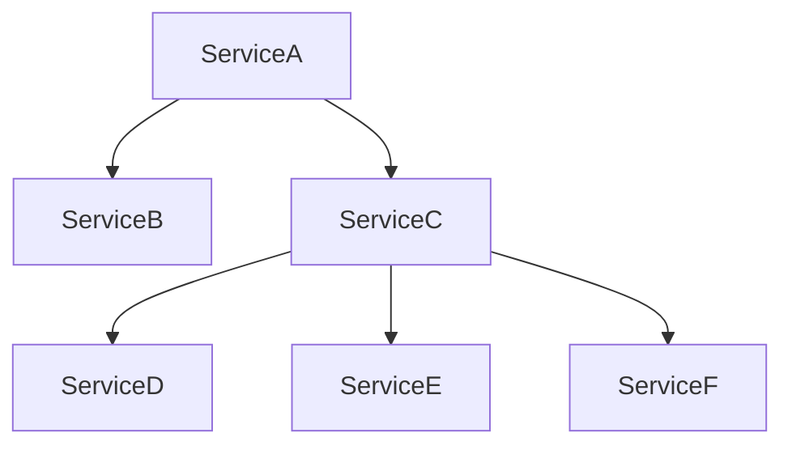

<p align="center" width="100%">
  
</p>

**Important note: This is still in the making but as this was requested, I'm open-sourcing the first version**.

# A practical introduction to the whys of Effect

This introduction comes from Effect workshops I gave in which the main objective was to explain in few hours the whys of Effect coming from raw JavaScript/TypeScript.

This introduction **is not about how to write Effect code** but rather focuses on why Effect might be an interesting pick for writing softwares using TypeScript as of today taking into account all the common problems we face as developers. As a rule of thumb, each developer should be aware of the problems a tool is solving before even trying to take a look at the implementation details. Hopefully with that short introduction you will **first become aware of the existing problems** and then **understand how elegantly and efficiently Effect solves them**.

## **Effect is a well-rounded tool solving a lot of well-known software engineering problems. Let's first talk about problems before solutions.**

**Inspiration**

This is highly inspired by both excellent talks from [Michael Arnaldi (@mikearnaldi) at the WorkerConf](https://www.youtube.com/watch?v=zrNr3JVUc8I) and [Mattia Manzati at React Alicante](https://www.youtube.com/watch?v=uwALExyq4NY).

N.B: If you're already comfortable with the problems Effect tries to solve and wish to jump straight into the **hows of Effect**, I suggest you to take a look at the official [Effect documentation](https://effect.website/) (still in the works) and the [excellent crashcourse from Stefano Pigozzi (@pigoz)](https://github.com/pigoz/effect-crashcourse).

## Samples and source code

In the `src/` folder you will be able to find some samples used alongside the introduction. There is also a TypeScript version if you prefer to both read the content and have the ready-to-be-run and type-checking samples.

Note: TypeScript files are still in the making so they might be incomplete/outdated as of now.  

## Outcomes you can expect from the introduction

- **Understanding most commons problems we're facing as developers**
- **Understanding limits we're facing as JavaScript/TypeScript developers**
- **Basic understanding of Effect**
- **Basic understanding of an "Effect System"**
 

Before diving into Effect, let's take a step back talking about what problems we commonly face as developers.
Effect is a tool in the same way as TypeScript is a tool. Our responsibility is to first understand the problems as it would help us finding the good solutions. 

What are the most common challenges we are facing when developing softwares?

- ### [**Explicitness**](#1-explicitness)
- ### [**Testing**](#2-testing)
- ### [**Resilience**](#3-resilience)
- ### [**Composability**](#4-composability)
- ### [**Concurrency**](#5-concurrency)
- ### [**Efficiency & Performance**](#6-efficiency--performance)
- ### [**Tracing & Logging**](#7-tracing--logging)
 

We'll show examples using TypeScript, but this is not only related to JavaScript/TypeScript concern. It **concerns every ecosystem, language**, for instance Effect was initially heavily inspired by [ZIO](https://zio.dev/), its Scala counterpart, because most of the problems also apply to Scala.

Hopefully, you'll realise that Effect is just a **tool that addresses hard problems** that we will always face, regardless the underlying ecosystem/language.


## 1. Explicitness 

The ability of making a program self-describing, allowing to have a clear vision and understanding what outcomes the program can produce without having to run it.

Ideally, what we want is:

- explicit errors
- explicit dependencies
- explicit outcomes

Let's see few examples using TypeScript first, then with Effect


## Synchronous computations

```ts
function multiplyNumber() {
  const generatedNumber = NumberGeneratorLibrary.generateRandomNumber();
  //    ^ number
  return number * 2;
}
```

Unfortunately when running the code our program crashes: `Error at <anonymous>`
Without taking a look at the implementation of the `generateRandomNumber()`, we don't even know that this thing might throw an error. The consequence of that is having runtime defect makes the process just die. Think of that in a wider scope of a program, where this can be very hard to properly handle. 

```ts
export function generateRandomNumber(): number {
    const randomNumber = Math.random();

    if (randomNumber > 0.9) {
      // RIP
      throw new Error();
    }

    return randomNumber;
}
```

This behavior can be the root cause of many problems including defensive coding, for instance:

```ts
function defensiveMultiplyNumber() {
  try {
    const number = NumberGeneratorLibrary.generateRandomNumber();
    return number * 2;
  } catch {
    // Just in case
  }
}
```

Or we need to deal with runtime errors the hard way:

```ts
function blindlyCatch() {
  try {
    const random = Math.random();

    if (random > 0.9) {
      throw new SomeError();
    }

    if (random > 0.8) {
      throw new SomeOtherError();
    }

    return random;
  } catch (exception: unknown) {
    if (isSomeErrorException(exception)) {
      // do something
    } else if (isSomeOtherErrorException(exception)) {
      // do something else
    }
  }
}
```

The solution that we just found is not ideal and even if there is only thirty lines of code, compromises must already be done because we simply lack of explicitness.


## Asynchronous operations

One way to model an async computation with JavaScript is using a Promise whose results is always delivered asynchronously.

```ts

function doSomething(): Promise<number> {
  return new Promise((resolve) => {
    setTimeout(() => {
      resolve(3)
    });
  });
}

doSomething().then(
  // Callback will be executed at some point in time (generally as soon as possible)
  () => {

  }
);
```

However, Promises are both conceptually limited and lacking a lot of important features to deal with common problems that we face.

## Drawbacks of a Promise 😥

- Eagerly executed, hence is impure, referentially-opaque and is running computation (already a value).
- Because of the reasons above, can't be used around for writing functional programs.
- Implicit memoization of the result (either success or failure).
- Has only one generic parameter: `Promise<A>`. The error is non-generic/non-polymorphic.
- Can't depend on any contextual information.
- No control over concurrency.
- Not much built-in combinators (then) and static methods (all, allSettled, race, any).
- No builtin interruption model.
- No builtin retry logic.

Promises are everywhere and are part of most codebases when dealing with asynchronous programming, so you might wonder what could be a solid alternative to that. Let's jump right into it.

## Alternatives 1/2

## fp-ts


[fp-ts](https://github.com/gcanti/fp-ts) created by [Giulio Canti (@gcanti)](https://github.com/gcanti) is the most popular functional programming library in the TypeScript ecosystem and provides developers with popular patterns and reliable abstractions from typed functional languages.

fp-ts introduced primitives that allow to model such things:

**Synchronous**

- `IO<A>`: Represents a lazy and synchronous computation that are not expected to fail, meaning that executing the thunk produces a value `A`. 
  
```ts
type IO<A> = () => A  
```

Because errors can't explicitely be represented using `IO<A>`, it means that conventionally the side effect must not throw any unexpected errors.

- `IOEither<E, A>`: When it comes to explicitely representing a typed error that can be produced by the execution of a synchronous computation, **fp-ts** provides us `IOEither<E, A>`. It represents a synchronous computation that can fail with an error `E`.

**Asynchronous**

- `Task<A>`: It is essentially the same as `IO<A>` except that it describes an asynchronous computation that is not expected to fail.
- `TaskEither<E, A>`: It is essentially the same as `IOEither<E, A>` except that it describes an asynchronous computation that is expected to fail with an error `E`.

Cool, we already found a solution to favor explicitness and model both the success or failure an operation can produce. It's a great step towards a stronger primitives, but still requires us to make a difference between asynchronous or synchronous computations. Why should we care about whether it's async or sync? We don't care! Ideally, we would like to be able to represent a computation that can both fail with an error `E` or succeed with a value `A` for all types of computations and always describe it the same way. There are already many difference between how to deal with asynchronous and synchronous error propagation, and there are even many ways to deal with asynchronous error handling (callbacks vs promises), we want to simplify that both at the type-level and at runtime.

Moreover, there is still:
- no builtin control over concurrency 
- no builtin interruption
- no builtin retry
- composing/combining multiple Tasks gets quickly hard to read
- semantic differences between synchronous and asynchronous operations
 
## Alternatives 2/2

**Effect**

The new kid in town


```ts
/**
 * An Effect is modeled with the datatype Effect<R, E, A>
 * (R) represents requirements a computation needs in order to be run
 * (E) represents the failure a computation can produce
 * (A) represents the successful outcome a computation can produce
 */ 
interface Effect<R, E, A> {}
```

In the context of explicit outcomes, `Effect` is a data type that can be used to model everything at the same time:
- no distinction between synchronous/asynchronous computations, everything is just a computation
- can be used to model computations that are expected to fail or not fail, the `Either` datatype is embedded in the Effect data type

But also Effect is:

- highly composable
- highly type-safe
- explicit errors and dependencies management (dependencies and `R` and discussed right after)
- builtin concurrency control
- builtin interruption 
- builtin retry
- builtin resource management (acquire/release)


The primary goal of an Effect is to act as a representation of a computation or more generally a program whose outcome (error or success) and dependencies are explicitely modeled.

## How we can improve that way of handling errors?

- Either (Result-like): solution implemented natively in Rust, Kotlin, Haskell... Can be implemented in TypeScript as well

```ts
interface Either<E, A> {
  readonly left: E;
  readonly right: A;
}

interface Result<Error, Success> extends Either<Error, Success> {}
```

Effect integrates an `Either<E, A>` under the hood of each computation, making it both easy and explicit to deal with.

```ts
type _ = Effect<R, E, A>
//                 ^__^ -> Either-like
```

Do you remember our first raw TypeScript samples? Let's rewrite it with Effect. Let's consider some code:

```ts

import { pipe } from "@effect/data/Function";
import * as Effect from "@effect/io/Effect";

namespace EffectNumberGeneratorLibrary {
  export function generateRandomNumber(): Effect.Effect<never, Error, number> {
    return pipe(
      Effect.sync(() => Math.random()),
      Effect.flatMap((randomNumber) => {
        if (randomNumber > 0.9) {
          return Effect.fail(new Error());
        }

        return Effect.succeed(randomNumber);
      })
    );
  }
}

```

If you take a close look at the `generateRandomNumber()` signature, you can see that we have the error typed as `Error`. Consequently if you describe an Effect that should not produce any known failure that is having the error channel typed as `never` (`Effect<never, never, number>`) and try to directly consume that effect, it won't compile.

```ts
function multiplyNumberWithoutDealingWithError(): Effect.Effect<
  never,
  never, // E is typed as 'never', this Effect is not expected to produce failures (in the same way as IO<A> or Task<A>) 
  number
> {
  return EffectNumberGeneratorLibrary.generateRandomNumber();
  // ^ Type 'Effect<never, Error, number>' is not assignable to type 'Effect<never, never, number>'
}
```

So how do we come from a description of a computation that will eventually produce a failure to a computation that does not produce failures? Dealing with errors in a recoverable fashion is pretty straightforward.

```ts
function multiplyNumberWhenDealingWithError(): Effect.Effect<
  never,
  never,
  number
> {
  return pipe(
    EffectNumberGeneratorLibrary.generateRandomNumber(),
    Effect.flatMap((number) => Effect.succeed(number * 2)),
    // Recovering from the error and producing a successful result value instead
    Effect.catchAll(() => Effect.succeed(0))
  );
}
```

After having described our recovery logic, the error channel is immediately being changed from `Error` to `never` meaning that `multiplyNumberWhenDealingWithError` computation can benefit from the description of a computation that won't produce expected failures. Consequently we can just deal nicely with that outcome by relying on the typings and be confident about the outcome of the computation.
 
Moreover, we can also model multiple failures using tagged classes

```ts

export class NumberIsTooBigError {
  readonly _tag = "NumberIsTooBigError";
  constructor(readonly error: string) {}
}

export class NumberIsTooSmallError {
  readonly _tag = "NumberIsTooSmallError";
  constructor(readonly error: string) {}
}

namespace Effect2NumberGeneratorLibrary {
  export function generateRandomNumber(): Effect<
    never,
    NumberIsTooBigError | NumberIsTooSmallError,
    number
  > {}
}
```

Then it's easy to deal with failures represented as a union, because we can pattern match and recover from either specific failures or all failures. Depending on that choice, pattern matched failures will be erased from the error channel and other ones will just remain until some recovery logic is defined at some point. 

```ts

function multiplyNumberWhenDealingWithErrors(): Effect<never, never, number> {
  return pipe(
    Effect2NumberGeneratorLibrary.generateRandomNumber(),
    // If there is no failure
    Effect.flatMap((number) => Effect.succeed(number * 2)),
    // If there are failures, pattern match 
    Effect.catchTags({
      NumberIsTooBigError: () => Effect.succeed(0),
      NumberIsTooSmallError: () => Effect.succeed(1),
    })
  );
}

```
 
**Explicit dependencies**

Effect can embed contextual information in the same way as the `Reader` data type from `fp-ts` was describing it.

It makes the dependencies required for the computation to be run also explicit. Let's say we have a very simple use case whose purpose is to register a new user on a given platform. 
The use case is meant to be agnostic of implementation details, that means that it ignores how the user registration is indeed persisted, whether it is in a database or some other storage service. 
The only thing the use case is responsible for is to orchestrate correctly all the business requirements. 
In our very simple example below, it's only registering the user to a given storage (in a real world application it could be dispatching a domain event, and putting both the user registration and the even dispatch in the same transaction, a la [Transactional Outbox](https://microservices.io/patterns/data/transactional-outbox.html) for instance).

```ts

import * as Effect from "@effect/io/Effect";
import * as Context from "@effect/data/Context";

interface UserRepository {
  createUser: () => Effect.Effect<never, UserAlreadyExistsError, CreatedUser>;
}

const UserRepository = Context.Tag<UserRepository>();

// Use case depending on an abstract User Repository
function registerUser(): Effect.Effect<UserRepository, UserAlreadyExistsError, CreatedUser> {
                                    // ^ explicit dependency
  return pipe(
    UserRepository,
    Effect.flatMap((userRepository) => userRepository.createUser()),
    // ... do something more as part of the use case, sending domain events, etc.
  );
}

```

What it means is that `registerUser` needs an instance of some service that implements the interface `UserRepository`. Otherwise, the program does not compile:

```ts
const mainProgram = Effect.runPromise(registerUser());
      // ^ Type 'UserRepository' is not assignable to type 'never': ts(2345)
```

We **can't compile the program because we didn't satisfy the dependencies**. One other benefit of having explicit dependencies is that conceptually the requirements are very clear and dependencies are not hidden/implicit. 
Dependencies appearing in the `R` generic type parameter is only refering to interfaces not any real implementations, this has for consequence to let room for the **Dependency Inversion Principle to easily spread everywhere in a effortless way**.

This example shows the use of one dependency, but it's important to note that Effect is able to **deeply infer the dependencies required as a TypeScript Union type**, wherever the dependencies come from in the Effect tree:

```ts
const computation1: Effect<DependencyA, never, number> = {};

const computation2: Effect<DependencyB, never, number> = {};

const program: Effect<DependencyA | DependencyB, never, number> = Effect.gen(function* ($) {
                      // ^ See how both respective dependencies from "computation1" and "computation2"
                      // now were propagated in the dependencies of our main program, represented as a typed union.
  const result1 = yield* $(effect1);
  const result2 = yield* $(effect2);

  return result1 + result2;
});
```

In that case, there is no deep Effect nesting but the principle remains the same.

If you're interested in the story behind the representation of the dependencies as a Union Type, [here is the section explaining that in the official Effect documentation](https://effect.website/docs/faq/coming-from-zio).

### Type-safe dependency injection

Just before, we mentioned the fact that until a required dependency is satisfied, the program won't compile. Effect provides us a type-safe dependency injection mechanism helping us satisfy the dependency graph.

```ts
Effect.runPromise(
  pipe(
    registerUser(),
    // Dependency injection
    Effect.provideService(UserRepository, {
      createUser: () =>
        // We don't care about the implementation, it could be anything.
        // Here we just satisfy the interface by producing the expected failure
        Effect.fail(new UserAlreadyExistsError("User already exists")),
    })
  )
);
```

Until we provide the service implementation, the program won't compile because all the computation requirements are not satisfied.

```ts
Effect.runPromise(something as Effect<SomethingService, never, void>)
// ^ This won't compile, a computation for which all the requirements are not satisfied (SomethingService) can't be executed.

Effect.runPromise(
  pipe(
    something, // now becomes Effect<never, never, void>, because an implementation matching the interface was injected.
    Effect.provideService(SomethingService, {})
  )
);
```

**Service composition**

In real-world application scenarios, services would also depend on a set of other services quickly creating a complex dependency graph to satisfy. 



Thankfully to manage dependency injection at scale, Effect embeds `Layers` which are **recipes for creating services in a composable, effectul, resourceful and asynchronous way**. 
Their goal is to overcome standard constructor limitations and offer more powerful and safe service construction primitives.

Layers describe a set of required dependencies (In) and produces a set of composed dependencies (Out). During Layer construction, errors can occur, hence the Layer signature:

```ts
export interface Layer<RIn, E, ROut> {}
```

In the same spirit as for Effects, using Layers for which dependencies are not satisfied will result in compilation errors. 

As part of the introduction, this `Layer` section ends up there. If you want to know more about Layers, here is a list of advanced resources:
- [Effect API reference](https://effect-ts.github.io/io/modules/Layer.ts.html)
- [Layer chapter from pigoz's crashcourse](https://stackblitz.com/github/pigoz/effect-crashcourse?file=006-layer.ts)
- [ZIO ZLayer documentation](https://zio.dev/reference/di/zlayer-constructor-as-a-value)

## 2. Testing

Testing is the ability of asserting that a system behaves as expected. As obvious as it may seem, testing can be very tricky if the program is coupled to implementation details and has implicit (hidden dependencies) that we can't control.

Thankfully, Effect is explicit towards dependencies and favors the use of the Dependency Inversion Principle (DIP) by forcing each computation to depend on an abstraction (interface) rather than on an implementation. 

Let's come back to our previous section example:

```ts
interface UserRepository {
  createUser: () => Effect.Effect<never, UserAlreadyExistsError, CreatedUser>;
}

const UserRepository = Context.Tag<UserRepository>();

function someUseCase(): Effect.Effect<UserService, UserAlreadyExistsError, CreatedUser> {
  return pipe(
    UserRepository,
    // ^ Just a Tag linked to an interface, there is no implementation yet.
    // The use case completely ignores the implementation of the repository,
    // it just relies on its interface.
    Effect.flatMap((userRepository) => userRepository.createUser()),
  );
}
```

Having that Dependency Inversion Principle applied together with the builtin dependency injection mechanism, we can easily test programs:

```ts

class InMemoryUserRepository implements UserRepository {
  createUser() {
    // 
  }
}

it("Should do something", async () => {
  const user = await Effect.runPromise(
    pipe(
      createUser(), 
      Effect.provideService(UserRepository, InMemoryUserRepository)
    )
  );
  expect(user).toEqual("something");
});

```

Note that this is also beneficial for many other use cases other than testing, for instance changing very easily implementations of a service without breaking code depending on the contract.

## 3. Resilience

Resilience is the art of being resilient of failures that is being able to handle efficiently and recover from all types of errors.

We saw that explicitness and type-safety offered by Effect allows us to erase a whole set of bugs and cleanly deal with errors. 

`If it compiles, it works` - slogan in the making. I can confirm that from my Effect experience since one year and a half.

Effect is a very powerful datatype, with a deep inference mechanism making Effect programs highly type-safe. It brings the type-safety to a whole new level by using TypeScript in a excellent way.

As we saw from the "Explicitness" part, Effect forces us to deal with errors case and forces us to describe computations that are both mathematically correct and make sense from a computer science perspective.

But most of the time, we don't only want to catch error, we also want to retry with some specific logic or any other specific behavior.

Using raw TypeScript, we know how to deal with an error happening, but how can we simply retry with some business rules?

```ts
async function businessUseCase() {
  throw new Error();
}

async function retry(fn: () => Promise<void>, times = 1): Promise<void> {
  try {
    await fn();
  } catch {
    if (times === 0) {
      return;
    }
    return retry(fn, times - 1);
  }
}

retry(businessUseCase, 5);
```


Great! But now, retry X times but on a specific condition 


```ts
async function businessUseCase() {
  const random = Math.random();
  if (random > 0.9) {
    throw new Error("error1");
  }
  throw new Error("error2");
}

async function retry(
  computation: () => Promise<void>,
  times = 1,
  shouldRetry: (e: unknown) => boolean
): Promise<void> {
  try {
    await computation();
  } catch (error) {
    if (times === 0 || !shouldRetry(error)) {
      return;
    }
    return retry(computation, times - 1, shouldRetry);
  }
}

retry(
  businessUseCase,
  5,
  (error) => error instanceof Error && error.message === "error2"
)
```


As we can see, the complexity grows very quickly for simple cases. As the `retry` function gets more specific, we:
- lose flexibility
- lose composability 
- lose the ability of having an error specialization
- increase the complexity
  
If we want to combine multiple rules, that is adding a specific debounce of exponential backoff, this would become nearly unmaintainable.


Thankfully, Effect also comes in with a rich set of builtin ways to deal with `retries`.

```ts
import * as Effect from "@effect/io/Effect";
import { pipe } from "@effect/data/Function";
import * as Duration from "@effect/data/Duration";
import * as Schedule from "@effect/io/Schedule";

pipe(Effect.fail(new Error("Some error")), Effect.retryN(5));

pipe(
  Effect.fail(
    Math.random() > 0.5
      ? new Error("Some error")
      : new Error("Some other error")
  ),
  Effect.retryUntil((error) => error.message !== "Some error")
);

pipe(
  Effect.fail(new Error("Some error")),
  Effect.retry(Schedule.exponential(Duration.seconds(1), 0.5))
);
```
 

And even more complex ones

```ts
import { pipe } from "@effect/data/Function";
import * as Duration from "@effect/data/Duration";
import * as Schedule from "@effect/io/Schedule";

export const retrySchedule = pipe(
  Schedule.exponential(Duration.millis(10), 2.0),
  Schedule.either(Schedule.spaced(() => Duration.seconds(1))),
  Schedule.compose(Schedule.elapsed),
  Schedule.whileOutput(Duration.lowerThenOrEqual(Duration.seconds(30)))
);
```


Still in the context of **Resilience**, Effect also allows to model interruptions and deal with the cases where some computation gets interrupted. It allows us to model an acquire/release logic that is safe towards interruption and prevent memory leaks.

```ts
pipe(
  Effect.asyncInterrupt(() => {
    const timer = setInterval(() => {}, 1000);
    return Effect.sync(() => {
      clearInterval(timer);
    });
  }),
  Effect.fork,
  Effect.flatMap((fiber) => Fiber.interrupt(fiber))
);
```

There is a guarantee that the release Effect return by the `asyncInterrupt` method will be executed. The interruption model also allows us to have a fine-grained control over interruptibility. 


## 4. Composability

The art of having a set of reusable software components that can be easily combined, extended, specialized and in a scalable, maintainable and understable way. 

Effect `does exactly that`. Thanks to all its primitives and very rich standard library, it allows us to model everything we need on a daily basis. 

```ts
pipe(
  TodosRepository,
  Effect.flatMap((todosRepository) =>
    pipe(
      [1, 2, 3, 4, 5, 6, 7, 8, 9, 10],
      Effect.forEachPar(todosRepository.fetchTodo),
      Effect.withParallelism(5)
    )
  ),
  Effect.retry(
    pipe(
      Schedule.exponential(Duration.seconds(1), 0.5),
      Schedule.whileOutput((duration) => duration < Duration.seconds(30))
    )
  ),
  Effect.mapError(() => new FetchError())
);
```


## 5. Concurrency

Concurrency is the art of running multiple computations cooperatively to improve the overall speed of the program execution.

`"concurrency is about dealing with lots of things at once"`, Rob Pike

Node.js is an example of a runtime leveraging concurrency on a single thread using an Event Loop to cooperatively execute asynchronous task.

**Reminder:** Doing a synchronous operation is faster than doing an asynchronous operation. But when combining multiple operations this is where concurrency becomes interesting.


Concurrency is very hard to do right

**Issues with Concurrency**

- Hard to get a deterministic execution model
- Shared resource problems 
- Deadlocks, resource starvation can occur
- Memory/CPU efficiency
- ... many more


**The Dining philosophers problem**, introduced in 1965 by Edsger Dijkstra

https://en.wikipedia.org/wiki/Dining_philosophers_problem


Earlier with JavaScript we talked about Promises that could be used to model asynchronous computations.

The problem: `Promises don't have any builtin way of having a fine-grained control over concurrency`


We can handle concurrency very easily!

:otter: `Promise.all`, `Promise.allSettled`

`Promise.all` and `Promise.allSettled` both allow you to run concurrently X operations but:

- no easy way of having a **bounded concurrency** 
- no resource safety, all other Promises keep being executed in the background in case of failures (even in case of success for `Promise.any` or `Promise.race`)  
- no easy way of handling interruptions 


**Bounded vs Unbounded concurrency**

`Bounded` can be used to qualify a limited resource in terms of memory space, memory usage, cpu usage, anything that should be limited (bounded).

- Bounded concurrency is the art of controlling how much operations can run concurrently.
- Unbounded concurrency is the opposite, that is using `Promise.all` :smile:


Example of an `Unbounded concurrency case`

```ts
const userIds = Array.from({ length: 1000 }, (_, idx) => idx);

function fetchUser(id: number): Promise<User> {
  // 
}


function retrieveAllUsers() {
  return Promise.all(
    userIds.map((id) => fetchUser(id))
  );
}
```


All Promises were spawned at the same time, blowing up both the Event Loop and the CPU.


Effect allows us to control the number of concurrent operations very easily:

```ts
pipe(
  userIds,
  Effect.forEachPar((id) => Effect.promise(() => fetchUser(id))),
  Effect.withParallelism(30)
);
```


And also allows to deal more advanced patterns with built in modules:

- STM (Software Transactional Memory): Transactional Data Structures & Coordination
- Semaphore: Concurrency Control


Promises: no resource safety/management. Even when the Promise fulfills, the other ones keep running in the background.
This can become a problem if the scheduling of leaking Promises is done a lot. It will blow up the CPU and load the Event Loop with unecessary work.

```ts
function quickRunningPromise() {
  return new Promise((resolve) => {
    setTimeout(resolve, 0);
  });
}

function longRunningPromise() {
  return new Promise((resolve) => {
    setTimeout(resolve, 5000);
  });
}

Promise.race([quickRunningPromise(), longRunningPromise()]);
```


Effect are by nature interruptible, meaning that all these operations are ressource-safe.

```ts
const quickRunningEffect = pipe(
  Effect.delay(Duration.seconds(1))(Effect.unit())
);

const longRunningEffect = pipe(
  Effect.delay(Duration.seconds(5))(Effect.unit()),
  Effect.onInterrupt(() => {
    console.log("interrupted!");
    return Effect.unit();
  })
);

Effect.runCallback(
  Effect.race(quickRunningEffect, longRunningEffect),
  () => {
    console.log("done");
  }
);
```


One great thing is the Effect runtime will automatically perform cleanup/release of the underlying tasks once a computation is interrupted.

Remember the previous example?

```ts
const interruptibleEffectWithAutoCleanup = Effect.asyncInterrupt(() => {
  const timer = setInterval(() => {}, 1000);
  // Cleanup/Release function
  return Effect.sync(() => {
    console.log("clear interval");
    clearInterval(timer);
  });
});

```

If we race something with that Effect and it loses, the cleanup function will be automatically called, by default in the background (asynchronously) or can be a blocking operation.

There are a lot of features around that, that are out of the scope of the introduction.


## 6. Efficiency & Performance

Efficiency and Performance are both related and unrelated at the same time.

- Performance: refers to how well a task is completed within a given time frame or how quickly a system can complete a task
- Efficiency: refers to the ratio of the output or result to the resources used to produce it

Achieving both requires careful consideration of tradeoffs and goals.

For instance, it's easy to nearly blow up the stack while the program is very performant.

Remember the `Promise.all` example? It will most likely execute faster than the Effect version, but the overall Performance of the program will be impacted (other tasks will take longer time) and Efficiency-wise, it's not ideal.


**Effect in essence**

Before going into that subject of `Efficiency & Performance`, it's important to understand the foundations of Effect.

Effect is in the first place an **Embedded Domain Specific Language (DSL)**. It uses TypeScript (Embedded) to describe a specific set of instructions that will be interpreted by a runtime (Effect Runtime). We call that DSL encoding **initial**.

Effect is _simply_ an `Embedded Domain Specific Language with Initial encoding`! 


Here is an example of a simple React DSL that helps us build Tables.

```tsx
  <Table<BrandPerformanceTurnover>>
    <Row>
      <Cell<BrandPerformanceTurnover>
        title={'something'}
        sort="enabled"
      />
    </Row>
  </Table>
```

Unlike Effect, this Table DSL is using a **Final** encoding meaning that the description is defined in terms of it's direct interpretation. In that case it means that there is a parent component that aims as an interpreter and will introspect all the children. The description is tighted to it's interpretation, not letting any room for multiple interpretations, optimizations and can be unsafe (Tables are not really concerned by that).

If you want to know more about TypeScript DSLs, [here is an excellent blog post](https://dev.to/effect-ts/building-custom-dsls-in-typescript-29el) from [Michael Arnaldi, the creator of Effect](https://github.com/mikearnaldi)


Let's demystify Effect


## Effect Systems

Effect is just a description! All data types are used to model a set of computations that represent our program.

One of the biggest strengths of Effect is that without even executing anything, by just leveraging mathematical concepts and the TypeScript compiler, it is already a proof of whether the program is correct or not.

The whole purpose of **Effect Systems** that aim to represent side-effectful operations that a program might process at some point. The objective is to have a full control and defer at the most end the execution of all those side effects, when the program was understood by both the compiler and the runtime.

It lets room for a lot of performance, composability, substitutions, optimizations, type-safety, stack-safety, concurrency...

See this brilliant article from [John A. De Goes, the creator of ZIO](https://degoes.net/about/): [no-effect-tracking](https://degoes.net/articles/no-effect-tracking)

**Effect Systems**


`Functional effect systems like ZIO (and Haskell’s IO data type) let us take side-effects and make them more useful, by turning them into values, which we can transform and compose, solving complex problems with easy and type-safe combinators that simply can’t exist for side-effecting statements`

**John A. De Goes, (creator of ZIO, Effect ancestor)**

Now that we have described our program using the Effect DSL, how to execute the underlying computation?

We need an **Interpreter**!

Let's do that.

**Effect Runtime**

Effect comes in with a builtin **fiber-based Runtime** that interprets the description. A Fiber is a **lightweight primitive** that deals efficiently with concurrency, scheduling, resource management, interruption etc. It is often refered as a virtual thread / green thread, meaning that it leverages cooperative multitasking using its own computational context that runs independently but that can easily be joined/forked/resumed/stopped/interrupted...

Thousands and even millions of Fibers can be spawned and run in a single thread. They are much more lightweight and efficient than operating system threads. Fibers can also be dispatched to be executed within many operating system threads (ZIO uses a threadpool).

Also:
Go implements its own native version of green threads using goroutines 
Kotlin, Java have their own green threads implementation for instance
Erlang...
C#...


Let's see how to use the built in Effect runtime! **(src/06-runtime.ts)**


Other interesting facts about the fiber-based runtime:

- It's stack safe, because it controls the execution of operations, it's able to determine how much operations it can execute on the current tick of the Event Loop. 
- It's memory efficient because after X operations (currently 2048), the fiber yields, letting the Event Loop breath and letting other tasks run.  
- It's overall faster, because the runtime can combine/batch/eliminate operations and tries to leverage synchronous operations as much as it can. 


## 7. Tracing & Logging

Effect also directly embeds primitives for Logging, Tracing and even Metrics.

It can be integrated with OpenTelemetry, Prometheus, etc.


Summary

- Explicitness :white_check_mark: 
- Testing :white_check_mark: 
- Resilience :white_check_mark: 
- Composability :white_check_mark: 
- Concurrency :white_check_mark: 
- Efficiency & Performance :white_check_mark: 
- Tracing & Logging :white_check_mark: 

All that in just one tool, with TypeScript.

The standard library is very rich and we didn't cover everything there! In addition to the standard library, there is also a set of useful additional packages:

- [@effect/schema](https://github.com/Effect-TS/schema)
- [@effect/match](https://github.com/Effect-TS/match)
- [@effect/cli](https://github.com/Effect-TS/cli)
- [@effect/rpc](https://github.com/Effect-TS/rpc)
- [@effect/process](https://github.com/Effect-TS/process)
- [@effect/fastify](https://github.com/Effect-TS/fastify)
  
And many more to come

Other resources: 

- **[Official Effect documentation](https://effect.website/)**
- **[@effect/io documentation](https://effect-ts.github.io/effect/)**

